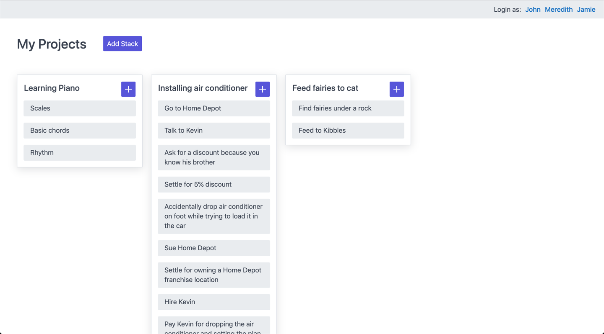
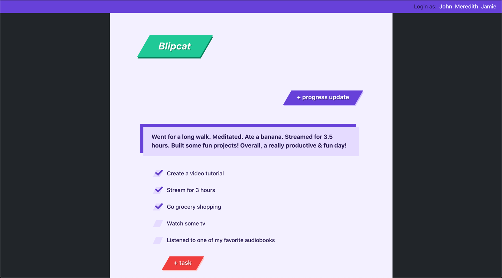

# RemakeJS

## Build web apps quickly

* **Low-code framework:** All of Remake's powers come from data attributes, which means you can build an entire web app with just HTML
* **Easy to edit data:** Powerful inline edit areas are built in, giving your users the ability to easily edit and remove data from the page
* **Auto-save:** User data is automatically extracted from the DOM and saved
* **Easy to learn:** A small API means that learning a dozen special data attributes will give you the ability to create a web application
* **A great experience for your users** Remake is for server-rendered web apps, which means your pages will load and render quickly, use native browser features (like routing and form handling), be accessible out of the gate, and you don't need to include Remake on non-editable pages
* **An enjoyable development process:** Because of how easy it is to learn and build with, Remake.js excels at helping you create new products _quickly_

**This is an early alpha release.**

## How to get started

1. [Try the example todos app](https://github.com/panphora/remake-todos), with Remake.js included 
2. Get it running locally by using the instructions in the [README](https://github.com/panphora/remake-todos/blob/master/README.md)
3. Read through the [annotated source code](https://quickstart.remakejs.com/) for a simple todo app
4. Read through the Remake.js [quick reference sheet](https://quickref.remakejs.com)
5. Provide feedback by [messaging me](https://twitter.com/panphora) on Twitter
6. Sign up for [the newsletter](https://newsletter.remakejs.com/) to get updates as this framework develops


## Try one of these example web apps: (Built with Remake!)

### 📖 [Kanban Board Project (TaskFellow)](https://github.com/panphora/task-fellow)



### 🚴 [Progress Update Tracker Project (Blipcat)](https://github.com/panphora/blipcat)



### ✅ [Todos Project](https://github.com/panphora/remake-todos)


---

**Note:** The documentation in the rest of this README is a thorough explanation of all the parts of Remake.js. However, if you're just getting started, it's recommended to start with the [Annotated Todos App](https://quickstart.remakejs.com/) or the [Quick Reference](https://quickref.remakejs.com).

## A High Level Overview

It's good to have an understanding of how everything fits together before diving in:

- With Remake, data is supposed to feel like a natural extension of the DOM. It's as if someone designed HTML from the ground up with some tools for handling, responding to, and inserting data.
- Use `data-o`-prefixed attributes to attach data to HTML elements
- Use `data-i`-prefixed attributes to set data on HTML elements
- Use `data-switch`-prefixed attributes to switch an element's state on or off
- Use `data-copy`-prefixed attributes to control an element's layout and positioning


**In practice, this usually works like this:**

1. The user clicks a `data-switch-action` element
2. An inline-edit popover will be switched on
   1. It will be turned on using the `data-switch` attributes
   2. It will be positioned using the `data-copy` attributes
3. The user edits the information inside the popover
   1. The data inside the popover will be updated with `data-i` attributes
4. The user saves the information inside the popover
5. Data from the popover will automatically sync back into the original `data-switch-action` element that triggered this process


## Full API

<u>Click here</u> for the full API specification.

**Note:** This is an early alpha release. The API isn't final. 


# Getting Started


## Table of Contents:

* 💥 How to **switch an element's states** on and off — useful for showing, hiding, and adding special styling to components when a user activates them.

* 💥 How to **attach data** to the DOM in a way that can be easily serialized into a nested object, using the built-in hierarchy of the page

  * Using regular data attributes
  * Using a special "location" data attribute
  * What about deeply nested data?

* 💥 How to let users **change data** that's attached to the DOM

  * With radio buttons
  * With button choices
  * With text inputs

* 💥 How to **save data** automatically

  * Saving flat data
  * Saving deeply nested data

* 💥 How to **add inline editing** using a single positioning attribute

  * Positioning
  * Positioning with width and height
  * Automatically syncing data

* 💥 How to **observe and react to data** changes

  * Using built-in watch functions
  * Writing your own

* 💥 What can we build with this?

* 💥 Best practices

* 💥 Browser compatibility (Goal: IE11 and up with polyfill.io, but needs testing)

  

  After finishing this tutorial, you'll be able to build a fully functional, multi-user, data-rich application that's easy to understand and build on top of, without the bloat of a "modern" front-end framework. However, keep in mind: Remake isn't meant to handle rendering for you: it's meant to sit on top of a traditional, server-rendered web app and make working with, modifying, responding to, and saving its data a whole lot simpler.


## Switching Things On and Off

Building web applications often requires handling **a lot** of dynamic states. Here are some examples:

* Showing and hiding confirmation dialogs
* Showing and hiding inline edit areas
* Showing and hiding menus
* Expanding and collapsing lists of items
* Showing the content of a single tab, while hiding the others
* … and lots more!


Instead of using a custom JavaScript library for each of these use cases, Remake includes a simple utility that allows you to toggle the state of any element by clicking on another element.


### a. Turning a single switch on

```html
<button data-switch-actions="helloWorld(on)">Show Contents</button>
<div data-switches="helloWorld">Hello World!</div>
```

Clicking on the `<button>` element will turn the switch named `helloWorld` on!

What does this mean? Well, after the `<button>` is clicked, the second element's markup will look like this:

```html
<div data-switches="helloWorld" data-switched-on="helloWorld">Hello World!</div>
```

Then, in our CSS, we can have a couple simple rules like this:

```css
[data-switches="helloWorld"] {
	display: none;
}

[data-switched-on="helloWorld"] {
	display: block;
}
```

Now, we have a working switch!


### b. What about multiple switches?

You might be curious about why we use a plural attributes, `data-switches` instead of `data-switch`. Well, that's because this little switch library is actually *much more* powerful than it might seem at first.

We can easily create a button that turns three switches on at once:

```html
<button data-switch-actions="helloWorld1(on) helloWorld2(on) multiverse(on)">Show Contents</button>
<div data-switches="helloWorld1">Hello World 1!</div>
<div data-switches="helloWorld1">Hello World 2!</div>
<div data-switches="multiverse">Welcome to the multiverse!</div>
```


### c. What about turning them off?

Since switches are used to implement toggleable items that should disappear when the user clicks elsewhere (i.e. dropdowns, popovers, inline edit areas), the default behavior is **all turned on switches turn off automatically** whenever you click somewhere.

In practice, this is the behavior you'll use most often. However, there are other important cases where this isn't the right behavior, so…

You can, of course, turn this behavior off very easily:

```html
<div data-switches="helloWorld(no-auto)">Hello World!</div>
```

This will cause the switch to stay turned on **unless** it's explicitly turned off.


### d. How do you turn switches off manually?

Turning switches on an off is easy. 

```html
<button data-switch-actions="helloWorld(off)">Show Contents</button>
```

Or we can toggle them on and off every time the action button is clicked too:

```html
<button data-switch-actions="helloWorld(toggle)">Show Contents</button>
```

Or do different actions to different switches from the same action button:

```html
<button data-switch-actions="helloWorld1(off) helloWorld2(toggle) multiverse(on)">Show Contents</button>
```


### e. Advanced: Stopping a switch from turning on or off no matter what

So, the above covers most of the basics. However, there are a few more things you'll want to learn about.

The first is how to prevent a switch from doing *anything* when a certain element is clicked.

Let's say you have a `<button>` that's nested inside of a switch action element that's nested inside another switch action element. Let's not talk about how you got here — you're building a web app, so *"it's complicated"* is a perfectly valid reason for finding yourself in such a tight spot.

How do you tell all the switch actions on all the ancestor elements to just ignore when someone clicks this button? You ***don't*** want to trigger the menu at the top of the page OR close the inline edit menu you currently have open — you want it to *just do nothing*.

Well, that's easy:

```html
<div data-switch-actions="adminMenu(on)">
    <div data-switch-actions="inlineEdit(off)">
        <button data-switch-stop="inlineEdit adminMenu">Just a Simple Button</button>
    </div>
</div>
```

This basically says, "hey, under normal circumstances I know clicking this button would trigger a couple actions, but I'd like to prevent those actions from triggering".


### f. Advanced: Grouping switches under one name

Ok, this is a good one too. So, say you're building an interface with *lots* of inline edit areas (like I was) and instead of writing CSS like this:

```css
[data-switched-on="inlineEditTitle"], [data-switched-on="inlineEditSummary"], [data-switched-on="inlineEditUserInfo"] {
    display: block;
}
```

You want to write CSS like this:

```css
[data-switched-on="inlineEdit"] {
    display: block;
}
```

Well, you're in luck! This is where secondary names come in!

You can assign a secondary name to any switch by passing it in as the *second* argument. This means you must always specify the first argument as well:

```html
<div data-switches="switchName1(auto, inlineEdit)"></div>
<div data-switches="switchName2(auto, inlineEdit)"></div>
<div data-switches="switchName3(auto, inlineEdit)"></div>
```

Now, your simpler CSS will work fine.

When you click on a button that looks like this:

```html
<button data-switch-actions="switchName1(toggle)"></button>
```

Then only your first switch will turn on:

```html
<div data-switches="switchName1(auto, inlineEdit)" data-switched-on="switchName1 inlineEdit"></div>
<div data-switches="switchName2(auto, inlineEdit)"></div>
<div data-switches="switchName3(auto, inlineEdit)"></div>
```

But it (and only it!) will get the secondary name! :)


### g. Advanced: Targeting a single turned on switch on an element with more than one

Let's say you have an element with multiple switches on it:

```html
<div data-switches="switchName1 switchName2 switchName3"></div>
```

And let's say all 3 of them are turned on at the same time:

```html
<div data-switches="switchName1 switchName2 switchName3" data-switched-on="switchName1 switchName2 switchName3"></div>
```

How the heck do you target that in your CSS? 

You need to be able to tell when any single one of those switches are on — or all of them, but you don't want to write 3 different selectors for the many different different orders they could appear in. For example:

```css
[data-switched-on="switchName1 switchName2 switchName3"], [data-switched-on="switchName2 switchName1 switchName3"], [data-switched-on="switchName2 switchName3 switchName1"], [data-switched-on="switchName1 switchName3 switchName2"], [data-switched-on="switchName3 switchName1 switchName2"] {
    /* styles for when all 3 are turned on */
}
```

Not to mention, what if only two are turned on?

This is where the `~` attribute selector comes in.

Here's how you'd use it:

```css
[data-switched-on~="switchName1"] {
    /* styles for when the first is turned on */
}
[data-switched-on~="switchName2"] {
    /* styles for when the second is turned on */
}
[data-switched-on~="switchName3"] {
    /* styles for when the third is turned on */
}
[data-switched-on~="switchName1"][data-switched-on~="switchName2"][data-switched-on~="switchName3"] {
    /* styles for when all 3 are turned on */
}
```

Simpler, right?

How does this CSS selector work? 

> It matches an attribute that has exactly that value — OR that value in a space-separated list.

This is perfect for the `data-swiched-on` attribute because it stores switched on values as space separated strings. Without the `~` attribute selector, this library wouldn't be as powerful as it is!


### h. Advanced: styling entire elements (or the entire page) based on a switch being turned on

This comes up a lot in web development, so you're probably pretty familiar with it if you've been making website for a while. Let's say you want to style an element based on a switch being turned on, but the switch is *inside* of the element you want to style — what can you do?

Easy! Just move the switch up to the element you want to style.

So, instead of this:

```html
<div class="fancy-element">
    <div data-switches="someSwitch"></div>
</div>
```

You would do this:

```html
<div class="fancy-element" data-switches="someSwitch">
    <div class="used-to-be-some-switch"></div>
</div>
```

Then, if you need to style both the `.fancy-element` and the child element, use something like this:

```css
.fancy-element[data-switched-on~="someSwitch"] {
    /* styles for when it's turned on */
}

.fancy-element[data-switched-on~="someSwitch"] .used-to-be-some-switch {
    /* styles for when it's turned on */
}
```


### i. Advanced: targeting ONLY parent components

One more thing. This also comes up a lot in web development! :)

Let's say you have several items for sale on your website and you want to give people the ability to expand the details of each one — and you want to use switches to do it. One way would be to simply name all the switches differently:

```html
<div class="item-for-sale" data-switches="itemDetails1">
    <button data-switch-actions="itemDetails1(on)">Show Details</button>
</div>
<div class="item-for-sale" data-switches="itemDetails2">
    <button data-switch-actions="itemDetails2(on)">Show Details</button>
</div>
<div class="item-for-sale" data-switches="itemDetails3">
    <button data-switch-actions="itemDetails3(on)">Show Details</button>
</div>
```

Then, when you click "Show Details", only the relevant item will be triggered. 

However, there's a much easier way: have the action element only affect its ancestor elements:

```html
<div class="item-for-sale" data-switches="itemDetails">
    <button data-switch-actions="itemDetails(on, ancestors)">Show Details</button>
</div>
```

Now you have much more flexible code — and it's more performant too!


## Attaching Data to the DOM


### a. Using regular data attributes


#### 1. Let's attach a data structure to an element

This HTML:

```html
<div data-o-type="object"></div>
```

Tells Remake: "Hey, I'm an object!"

Without any other attributes, it will be converted into this:

```json
{}
```

Pretty easy, right?

You can do this conversion yourself using a helper method `getDataFromRootNode(element)`, but, most of the time, converting DOM nodes to data happens automatically and you don't need to convert it manually.


#### 2. Now, let's get some actual data in there

This:

```html
<div data-o-type="object" data-o-key-name="Fred"></div>
```

Turns into this:

```json
{name: "Fred"}
```


#### 3. What about arrays?

That's easy! 

This:

```html
<div data-o-type="list"></div>
```

Turns into this:

```javascript
[]
```


#### 4. What about nested data?

Well, we can put objects into arrays:

```html
<div data-o-type="list">
	<div data-o-type="object" data-o-key-name="Fred"></div>
    <div data-o-type="object" data-o-key-name="Penny"></div>
    <div data-o-type="object" data-o-key-name="Charlie"></div>
</div>
```

The above lines get converted into:

```javascript
[
    {name: "Fred"}, {name: "Penny"}, {name: "Charlie"}
]
```

And we can put objects into objects:

```html
<div data-o-type="object">
	<div data-o-key="userData" data-o-type="object" data-o-key-name="Fred"></div>
    <div data-o-key="pageSettings" data-o-type="object" data-o-key-page-title="Hello World!"></div>
</div>
```

The above lines get converted into:

```javascript
{
    userData: {
        name: "Fred"
    },
    pageSettings: {
		pageTitle: "Hello World!"
    }
}
```

If this last one is confusing to you, that's ok — it's a little confusing at first.

Basically, whenever any element has a `data-o-key` attribute set to a value, its data will be placed inside a key name equal to that value.

So, if I have this list:

```html
<div data-o-type="list"></div>
```

Which would normally be converted into just a simple list:

```javascript
[]
```

I can add it to an object's key by wrapping it in an element of type `object` and giving the list element a key name:

```html
<div data-o-type="object">
	<div data-o-key="itemsForSale" data-o-type="list"></div>
</div>
```

The above lines will be converted into:

```javascript
{
    itemsForSale: []
}
```


### b. What about data we'd like to store in its natural location?

#### 1. Introducing location attributes

There are many cases where it doesn't make sense to store a bunch of data locked away inside data attributes. You want that data to live where it already is. For example:

* As the `innerText` of a `<div>`
* As a `value` of an `<input>`
* In the `src` attribute of an ``

How can we access this type of data and add it to the rest of our data?

For this, we have a special `data-l-key` attribute. The `l` stands for "location". It tells the data parser to look in a certain location.

> Hey, data parser, I don't have the data myself, but you can go find it here...

So, let's return to an earlier example:

```html
<div data-o-type="object" data-o-key-name="Fred"></div>
```

Most likely, this name will be displayed on the page somewhere, so your element is more likely to look like this:

```html
<div data-o-type="object" data-o-key-name="Fred">Fred</div>
```

The problem with this is now you have to update the `innerText` of this element whenever this `data-o-key-name` changes. You have to keep them in sync somehow.

There's a way around this though — **let's just store the data in one place!**

```html
<div data-o-type="object" data-l-key-name=". innerText">Fred</div>
```

The `.` is a placeholder for a selector that means: "look in the current element". And `innerText` is the property you want to access.

Now, when this element is serialized, you'll get the same thing we got before:

```javascript
{name: "Fred"}
```

Except, now, we're storing the data in just one place!

And, there's a **bonus!**

The "location" key (e.g. `data-l-key-name`) defaults to looking in the current element's innerText if no value is specified for this attribute.

So, this:

```html
<div data-o-type="object" data-l-key-name=". innerText">Fred</div>
```

Is equivalent to this much simpler version:

```html
<div data-o-type="object" data-l-key-name="">Fred</div>
```


#### 2. Advanced: Using location attributes to get other types of data

Let's say you want to get data from a bunch of image elements.

```html
<div data-o-type="list">
    
    
    
</div>
```

The syntax for this just involves using a "attr:" string before the attribute you want to get:

```html
<div data-o-type="list">
    
    
    
</div>
```

The above would be transformed into this:

```javascript
[{imageUrl: "cat1.png"}, {imageUrl: "cat2.png"}, {imageUrl: "cat3.png"}]
```

As a general rule, if you want to get the value of a property (e.g. `value`, `innerHTML`) from an element, you don't need to prefix it with anything. However, if you want to get the value of an attribute, just prefix that attribute with "attr:".

Another example just for good measure:

```html
<div data-o-type="list">
    <div data-o-type="object" data-l-key-name=". attr:data-name" data-name="robot1"></div>
    <div data-o-type="object" data-l-key-name=". attr:data-name" data-name="robot2"></div>
</div>
```

The above will be converted into:

```javascript
[{name: "robot1"}, {name: "robot2"}]
```


### c. What about deeply nested data?

#### 1. Introduction to deeply nested data

In a large web application, we'll probably be working with lots of data that's changing all the time — and is nested inside arrays that are nested inside objects that are nested inside other objects.

So, let's go through a more real-world-type example.

This HTML structure:

```html
<div data-o-type="list">
	<div data-o-type="object">
        <div data-o-type="object" data-l-key-title="">Sales and Marketing Bundle</div>
        <div data-o-type="object" data-l-key-description="">I will help you market your services.</div>
        <div data-o-type="object" data-l-key-price="">$500</div>
        <div data-o-key="timeline" data-o-type="list">
            <div data-o-type="object" data-l-key-name="">Customer Research</div>
            <div data-o-type="object" data-l-key-name="">Competitor Research</div>
            <div data-o-type="object" data-l-key-name="">Customer Outreach</div>
            <div data-o-type="object" data-l-key-name="">Marketing Plan</div>
            <div data-o-type="object" data-l-key-name="">Sales Channel Exploration</div>
            <div data-o-type="object" data-l-key-name="">Building a Sales Funnel</div>
        </div>
    </div>
</div>
```

This will transform into this:

```javascript
[
    {
        title: "Sales and Marketing Bundle",
        description: "I will help you market your services.",
        price: "$500",
        timeline: [
            {name: "Customer Research"},
            {name: "Competitor Research"},
            {name: "Customer Outreach"},
            {name: "Marketing Plan"},
            {name: "Sales Channel Exploration"},
            {name: "Building a Sales Funnel"}
        ]
    }
]
```

Pretty nice, right?

And you can easily add more "bundle" objects into the parent list and start building out a lot of data.


#### 2. Deeply nested data best practice: Keep your data up high

There's one tip here that you'll want to remember:

**As your data gets more complicated and nested, you'll be tempted to leave the data attached to the element that has that data in it. However, it's always better to push data up into ancestor elements as much as you can. It gives you more flexibility in how you style your child elements based on this data — and, more importantly, it creates natural parent component out of the ancestor element, so you can have a single source where a lot of the action can flow in and out of, instead of trying to wrangle a bunch of separate child elements at the same time.**

In order to use ancestor elements as natural components, all you have to do is move all the data attributes up into them:

```html
<div data-o-type="list">
	<div data-o-type="object" data-l-key-title=".bundle-title" data-l-key-description=".bundle-description" data-l-key-price=".bundle-price">
        <div class="bundle-title">Sales and Marketing Bundle</div>
        <div class="bundle-description">I will help you market your services.</div>
        <div class="bundle-price"></div>
        <div data-o-key="timeline" data-o-type="list">
            <div data-o-type="object" data-l-key-name="">Customer Research</div>
            <div data-o-type="object" data-l-key-name="">Competitor Research</div>
            <div data-o-type="object" data-l-key-name="">Customer Outreach</div>
            <div data-o-type="object" data-l-key-name="">Marketing Plan</div>
            <div data-o-type="object" data-l-key-name="">Sales Channel Exploration</div>
            <div data-o-type="object" data-l-key-name="">Building a Sales Funnel</div>
        </div>
    </div>
</div>
```

Here, we use the power of location attributes to grab data from child elements by their class name. By default, as we said before, they'll look inside these child elements' `innerText` property. 

One huge advantage of moving data up into ancestor elements is that it makes editing this data from *anywhere* inside the child elements a lot easier. They just have to look at their ancestors for the data, which is a big part of how Remake works: **Data always travels up.**


### Changing Data

Ok, now let's learn how to change values:


**a. With radio buttons**

```html
<div data-o-type="object" data-o-key-favorite-animal="cats">
	<div>
        <label><input data-i name="favoriteAnimal" type="radio" value="cats" checked="checked"> Cats</label>
    </div>
	<div>
        <label><input data-i name="favoriteAnimal" type="radio" value="dogs"> Dogs</label>
    </div>
</div>
```


🛠 Try it out:

🔘 Cats

🔘 Dogs


This is the result of parsing the selection above:

```json
{favoriteAnimal: "cats"}
```


**b. With button choices**

Choices can be added to any kind of element, not just radio buttons.

```html
<div data-o-type="object" data-o-key-favorite-animal="cats">
	<button data-i data-i-key-favorite-animal="cats">Cats</button>
  	<button data-i data-i-key-favorite-animal="dogs">Dogs</button>
</div>
```


🛠 Try it out:

[ Cats ] - button

[ Dogs ] - button


This is the result of parsing the selection above:

```json
{favoriteAnimal: "cats"}
```


**d. With text inputs**

You can also set data with an `input` or `textarea` element:

```html
<div data-o-type="object" data-o-key-progress-update="">
	<input type="text" data-i data-i-key-progress-update="">
</div>
```


🛠 Try it out:

[                    researched new opportunity                       ] - input element


This is the result of parsing the text written in the input above:

```json
{progressUpdate: "researched new opportunity"}
```


### Saving Data

Now, what this has all been leading up to: Saving data


#### a. Saving flat data

Back to our old example:

```html
<div data-o-type="object" data-o-key-name="Fred"></div>
```

Let's make it save:

```html
<div data-o-save="saveUser" data-o-type="object" data-o-key-name="Fred">
	<button data-i-click-to-save>Save</button>
</div>
```

That's it! That's all you had to do!

What will this do? Well, when the save button is clicked, Remake will:

1. Look for the closest ancestor with a `data-o-save` attribute
2. The data on that element will be serialized (i.e. turned into an object)
3. The data will be passed into a functioned named by the `data-o-save` attribute

In the above case, it will call a function named `saveUser()`.

Here's how we can define that function to pass data back to our server:

```javascript
import RemakeJS from "remakejs";

RemakeJS.onSave({
    saveUser: function (data) {
        fetch('/saveUser', {
            method: 'POST',
            body: JSON.stringify(data)
        })
    }
})
```

Notice that `saveUser` automatically gets passed some data. That's the data that was on the element with the `data-o-save` attribute. So, in this case, it looks like this:

```javascript
{name: "Fred"}
```


#### b. Saving deeply nested data

For nested data, we use the `data-o-save-deep` attribute instead of the `data-o-save` attribute. They both do the same thing:

1. Look for the closest ancestor with a `data-o-save` attribute
2. The data on that element will be serialized (i.e. turned into an object)
3. The data will be passed into a functioned named by the `data-o-save` attribute

The only difference is, in step 2, `data-o-save-deep` will serialize not just the current element, but also all the child elements.

So, using this example:

```html
<div data-o-save="saveProgressUpdates">
    <div data-o-type="list">
        <div data-o-type="object" data-l-key-text="">Researched market</div>
        <div data-o-type="object" data-l-key-text="">Interviewed customers</div>
        <div data-o-type="object" data-l-key-text="">Established pricing</div>
    </div>
	<button data-i-click-to-save>Save</button>
</div>
```

The save function, `saveProgressUpdates`, will get this data:

```javascript
[{text: "Researched market"},{text: "Interviewed customers"},{text: "Established pricing"}]
```


### Inline editing

Bringing it all together now!

// todo


When a save button is clicked or a form is submitted, Remake automatically looks to see if that form was switched on by another element. If it was, data from switched on element is automatically synced back to the element that triggered it.

The coolest thing about the copy-layout attribute is that it'll make the inline edit element ***naturally responsive*** because it will be exactly as big as the element it's editing. Unfortunately, elements positioned with copy-position won't be naturally responsive and require a little more custom CSS. (It's possible we'll add a layout library like popper.js to address this)


**Good to know:** Data *always* syncs ***up*** into ancestor elements, *never* down.


### Observing and reacting to changing data

Ideally, you won't need to do this. Ideally, you've written your web app in a way that what the user sees is what your data looks like. But, we all know that isn't the case.

You need to react to changes, so you can:

* Format dates
* Pluralize words
* Hide or show components

That's where reacting to changes come in.

// todo


**Good to know:** Data *always* flows ***down*** into watch functions, never up.


### What can we build with this?

Anything! THis is a *super* powerful framework based on a decade of experience doing web development. 


While you can build any type of application with this, it excels at making **editable web pages** that your users can edit, theme, and style on the fly. 


**Strong suites:** 

- Making website builders of any kind
  - Sales pages
  - Landing pages
  - Portfolio pages
  - Resume pages
  - Personal websites
- Email templates
- Form builders


It's good at making all kinds of sites, but customizeable page builders is where it shines.


#### Demo Application Code

Although I recommend reading through the entire Getting Started tutorial below, you can also just start playing around with this demo application:

[Download Example Remake Application]

**Note:** This example app is built on Node, Express.js, Pug.js, and MongoDB. You're free to use any stack you want on the back-end.


### Suggested Best Practices

First off: there is no hard and fast rule. That being said, here are our suggestions.


In order to build a page that loads quickly on **initial** load:


Why is this important?

* Sales & conversion rate
* Usability
* Going worldwide


---

* Render the intial page — and all dynamically-added components on the server
  * The goal of these libraries is simply this: pass all the data your back-end templates need to render a page. It's doesn't handle rendering. 
    * Why? When we render on the server, things are *simple*. We can build web apps *faster*.
    * Also, server-rendered apps are easier to use out of the box. You get a bunch of native browser features that frameworks try to rebuild from scratch.
    * Also, our views can be rendered without any front-end code, so a site is viewable and browseable without any JavaScript (cuts down dramatically on script download time and processing time)
    * We can deliver a super-fast experience even to people browsing our websites on slower 3G networks.
  * So, what does this mean? It means, if we're adding a new item to the page, we need to render it on the server and pass it back through and AJAX call before appending it to the DOM.
    * Why? This way, all of our view logic is in one place: on the server. When we render our initial page and when we render a new component that's being added to that page, it's happening in the same way. 
* Don't rely on the front-end to render or format data, so user's can see the page as it's expects to be before any JavaScript is run
  * This means having the same formatting helpers on the front-end and the back-end
* **Can I do it differently?** Of course you can! These are only suggestions.
  * After 10 years building web apps — the past 5 years doing it solo a lot of the time — I've learned that a simple, reliable development process beats a complex, but powerful process every time. 


# API

## Data attributes


## Methods


# About


##  About the author

Hi! My name is David! I live and work in Boston. I've been a web developer at various startups for the past 10 years. I started my first startup out of college and I'm currently working on Artisfy and RequestCreative, two services that help freelancers find and promote their work. I think the future of work is independent and decentratlized.


## Libraries Remake was inspired by

### React and Elm

- Data -> Function -> View
- I think modern front-end frameworks get a lot right in terms of delivering a great developer experience, but the one thing I hate is how far away they take you from the DOM. I love working directly with vanilla JavaScript and HTML — not lifecycle methods and fancy APIs just to get access to a piece of data or an element on the page. 

### Easy Toggle State

- Beautiful, simple library
- Discovered after Switch.js was built

### Stimulus

- Adding dynamic features to server-rendered sites

### jsonify

- Turning DOM elements into JSON objects
- Came across while researching Output.js


